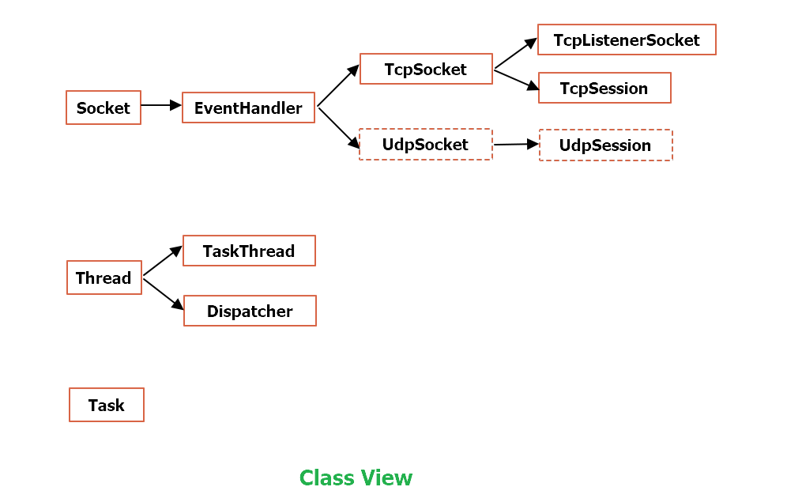
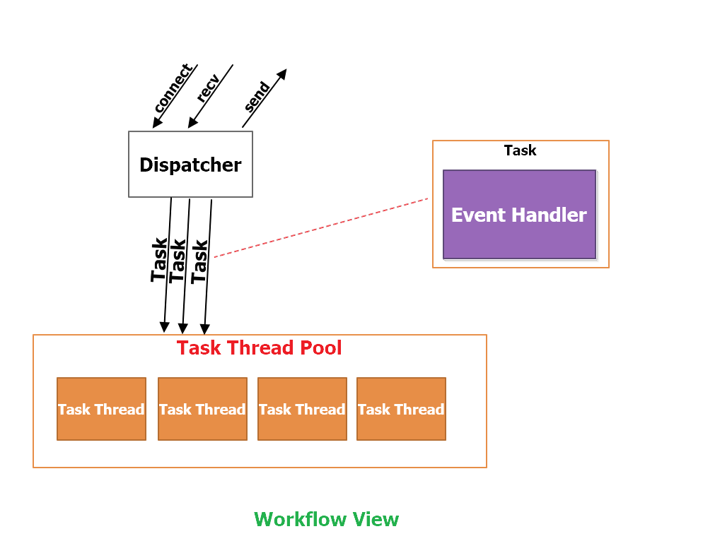

# Introduction

**Platform**: Linux

RTMP like protocol implementation, but without complicated header, it can be used as realtime transfer.  
they are where it can be used to:  

1. realtime file transfer  

2. realtime video, like rtmp protocol, server is just transfer what he received and copy many of it to puller which is match up with packet app 
 
3. etc.  

This project has three part: pusher,server and puller  
if you familiar with rtmp protocal, it would be self-explanatory.  
**RTMPPusher**: pushing local data to server  

**RTMPServer**: transfer data and copy it to multi-copy to many pullers  

**RTMPPuller**: pulling data from server  

# Showcase(30 pusher vs 30 puller)

I was tested on my WSL(Ubuntu 18.04.3 LTS)  
At first, I start RTMPServer as a background process.  

Then, I use shell script to start 30 pusher and 30 puller simultaneously pushing and pulling 30 files(each file is 13MB) to make a high concurrency test.  

The script will generate the dir for every pusher&puller and named with a timestamp, all pulling data from pusher would finally received by puller and saved in their dir.

The Powershell will show the server running log, when and how many pusher has finished pushing data, how many puller has finished pulling data.

Once pusher or puller has finished their job, they will send a fin packet at last and shutdown immediately(marked as lost).

Finaly, as you see, all the mp4 files is received successfully(each file is 13MB) and without any packet loss.

# Classes View

# Workflow View(Reactor Mode)

I have finished a stub for this mode, you can have a look at [reactor_server](https://github.com/BrianYi/reactor_server.git)

# Compile

IDE is VS2017 for Linux development you need install Linux development.

1.Open up `RTMPServer.vcxproj`, build it, running it with release edition  

2.Open a new bash in test directory, and type in sh batch_test.sh  
you should have a look at `batch_test.sh`, which has defined a switch to mode selection(`debug` or `release`).  

you need to configure:  
- **puller_num**  
  _puller number_
- **puller_app**  
  _which appname do you want to pulling from server?_
- **dst_dir**  
  _`/path/to/place/generated/files` for place batch_test.sh generated files, and of course with pulling data contained_
- **pusher_num**  
  _pusher number_ 
- **pusher_app**  
  _what would you want to name your pushing, it always be a name which describe the pushing data type(xxx.txt,xxx.mp4,xxx.word,etc)_  
- **pusher_video_path**  
  _`/path/to/video/file`, pusher will read from it and pushing data to server_

3.Watch the statistics info show up by server(refresh every 1s)  
all the generated files and pulling data would store at `dst_dir`, every pusher would generate a directory named with `timestamp` generated by `$(date +%s%N)`  

# Directory Hierarchy
## RTMPServer
**RTMPServer/**
- **RTMPServer.cpp**
- **Log.h**
- **Log.cpp**
- **Packet.h**

## test
**test/**  
- **batch_test.sh**	  
  _for batching test_
- **clean.sh**  
  _for cleaning the files and directories generated by batch_test.sh_
- **kill.sh**  
  _for killing all accidently process spawned by batch_test.sh(if server shows up some zoombie process, you can use it to get them off)_
- **start_puller_pusher.sh**  
  _core sh_
- **start_server.sh**  
  _don't use it(it would be bizaro to show under bash),directly using the compiled exe plz._
- **test_one.sh**  
  _one test_

# TODO

# BUGS

# Authors
- Brian Yi